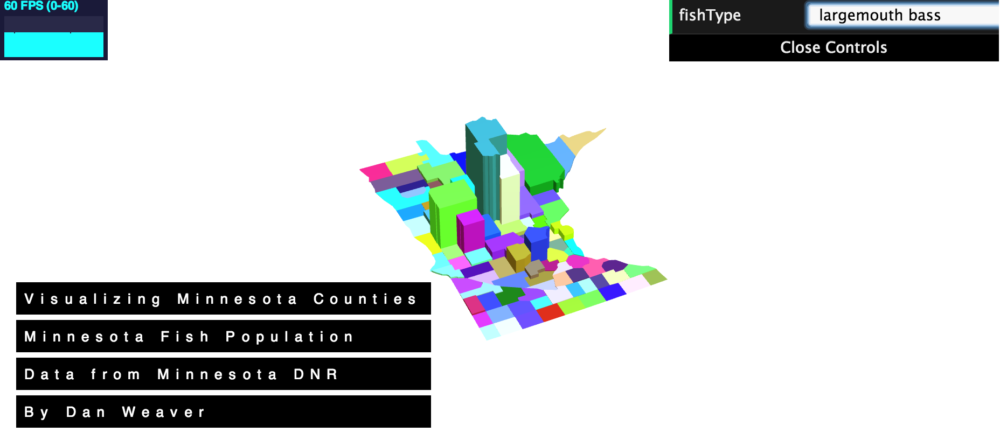

# Visualizing Data with THREE.js

This is a fork of @mflux's THREE.js sample for Eyeo. Instead of county population and income data, it plots fish population size estimates for each Minnesota county.

# Original README

What you will learn in this workshop:

1. Learn how to find, extract, and import data.

2. Use THREE.js and other tools to visualize this data.

===========

## Getting Started

1. git clone https://github.com/mflux/eyeodatavis.git eyeodatavis or download https://github.com/mflux/eyeodatavis/archive/master.zip then extract files to your desktop.

2. Run a webserver
MAC USERS:
Open up a terminal (command+space and type terminal and hit enter)
Navigate to the cloned (or unzipped) directory
Run a SimpleHTTP server (python -m SimpleHTTPServer)
PC USERS:
Mongoose
Cygwin
Dropbox

3. Open up a webrowser and navigate to localhost:8000 or whatever port your web host software is using.

4. Open up a text editor and source code (start with visualization.js)

5. Start hacking!

===========

## Pick a Challenge

### Beginners
You barely know javascript, all of this 3D graphics stuff is overwhelming to you and what the heck is a CSV? Well you're in luck, follow along the workshop demos.

### Intermediate
You can dance your way around code, but perhaps have never touched THREE.js. You've made some visualizations, maybe even got a few D3 karate belts at home. I challenge you to find new data, preferably part of Minneapolis County level data, and make this existing visualization do new and exciting things.

### Advanced
You are a javascript ninja and three.js is child's play. Alright let's rock. Find another SVG map, get it rendering as 3D meshes. Find another data-set, and see if you can inject this data within the framework. And maybe at the end you're going to make everything dance to music.

===========

## Libraries

THREE.js, a webgl/canvas rendering engine
(Reference: http://threejs.org/docs/ )

### Other libraries you might run into:
dat.gui, a quick and easy way to create sliders and dropdown menus
(Reference: http://workshop.chromeexperiments.com/examples/gui/#1--Basic-Usage )

two.js, a 2d animation library, used here for reading SVG data (Reference: http://jonobr1.github.io/two.js/#documentation)

JQuery, for wrangling html and DOM cross compatibility
(Reference: http://oscarotero.com/jquery/ )

Underscore.js, a swiss-army-knife for Javascript
(Reference: http://underscorejs.org/ )

===========

## Data Sources
Look for any parsable .csv or .json files that interest you. The below are data sets for Minnesota, but feel free to find data on other states or countries!

http://capitolcode.mn.gov/data/

http://www.demography.state.mn.us/resource.html?Id=18667

http://www.census.gov/econ/cbp/download/

https://www.census.gov/popest/data/datasets.html

http://www.state.mn.us/opendata/data.html

http://www.dhs.state.mn.us/main/idcplg?IdcService=GET_DYNAMIC_CONVERSION&RevisionSelectionMethod=LatestReleased&dDocName=dhs16_144804

http://www.mngeo.state.mn.us/CTU/

http://www.demography.state.mn.us/projections2015-2045.htm

===========

## How to contact me
EMAIL:    flux.blackcat@gmail.com
TWITTER:  @mflux
WEB:      ghost-hack.com
